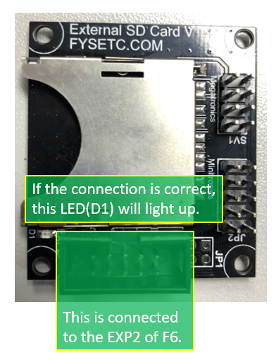

# Very important

At the moment this firmware only works with F6/6 board , please use the firmware below:

F6 V1.3 : https://github.com/FYSETC/Marlin-2.0.x-FYSETC/tree/F6/V13

F6 V1.4 : https://github.com/FYSETC/Marlin-2.0.x-FYSETC/tree/F6/V14

S6 : https://github.com/FYSETC/Marlin-2.0.x-FYSETC/tree/S6/MASTER

And you can use the software bellow to design your own UI that base on our UI.

UI design software : https://github.com/FYSETC/FYSTLCD-DGUS

# Step by step setup the touch screen on F6

## 1.wiring diagram

As you can see, this is a serial screen, the hardware is connected to F6 by serial port 2.
On the F6, there are two interfaces that can be connected to the touch screen. By default, the FPC connector is used.

note：If you want to connect via J1, please note that the TX and RX of the serial port need to be crossed.

The screen does not have an SD card socket for printing, so we have gave an SD card module for free.

wiring diagram:

## 2.Software setup 

In order to use this serial screen, you need to configure marlin and add some codes.

We have uploaded the configured marlin source code to github: https://github.com/FYSETC/Marlin-F6

(If you just want to test the screen, you can download the .hex file directly and uploade it to F6 with xloader. https://github.com/FYSETC/Marlin-F6/blob/master/Marlin/Marlin.F6.TFT.hex)

The screen of the shipment we have burned the firmware, if you want to make some changes, here is the screen firmware : https://github.com/FYSETC/FYSTLCD.

1.uploade the firmware to F6

2.connect the touch screen to F6 by the FPC cable

3.connect the SD module to F6 by the gray cable

4.power up the F6 with 12V or 24V power supply ,(You can't just use the USB to power the board, if you do

 that, the screen will be powerless and display white screen.) 

## 3.Uploade screen firmware to screen

Step 1：Format the TF card and copy files
run windows command system as administrator, then enter：

format g:/fs:fat32/a:4096/q

Note: 
g is the disk number of your TF card，and the card size must be 1-16G.

Step 2：Flash the firmware to TF card
Insert the TF card into the card socket (back side of the screen) ,and then power on the screen. 
Wait for the blue screen and appear on the first line of the screen “SD Card Process... END !” it’s may take 1-2minutes.
Turn off the power and re-power the screen Wait for the boot screen，it’s may take 1-5s.

Youtube video：
https://www.youtube.com/watch?v=Ez6qQsYpgLg&feature=youtu.be

## 4.where to buy

Aliexpress：
https://www.aliexpress.com/item/FYSETC-F6-V1-3-ALL-in-one-Mainboard-4-3-Touch-Screen-6pcs-TMC2100-TMC2208-TMC2130/32961471929.html
