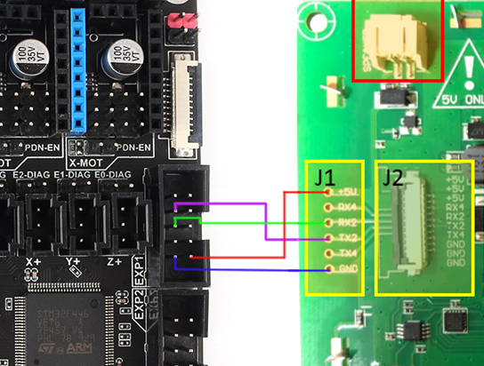

# Very important

At the moment this firmware only works with F6/S6 board , please use the board firmware below:

F6 : https://github.com/FYSETC/Marlin-2.0.x-FYSETC/tree/F6/2.0.x

S6 : https://github.com/FYSETC/Marlin-2.0.x-FYSETC/tree/S6/MASTER

And you can use the software bellow to design your own UI that base on our UI.

UI design software : https://github.com/FYSETC/FYSTLCD-DGUS

# Step by step setup the touch screen on F6

## 1.wiring diagram

Following is the touch screen layout.

- ### F6 - Screen

As you can see, this is a serial screen, the hardware is connected to F6 by serial port 2.
On the F6, there are two interfaces that can be connected to the touch screen. By default, the FPC connector is used.

note：If you want to connect F6 via J1, please note that the TX and RX of the serial port need to be crossed.

- ### S6 - Screen

  For S6 v1.2 you need to connect the screen with ordinary wires as picture shows below.

  

- ### SD module

The screen does not have an SD card socket for printing, so we have gave an SD card module for free.

## 2.Marlin firmware setup 

In order to use this serial screen, you need to configure marlin.

### F6:

F6 : https://github.com/FYSETC/Marlin-2.0.x-FYSETC/tree/F6/2.0.x

According to the board version , you need to change MOTHERBOARD define :

#define MOTHERBOARD BOARD_FYSETC_F6_13

#define MOTHERBOARD BOARD_FYSETC_F6_14

Enable screen UI type: (It means remove "//" at the front of the following line)

#define DGUS_LCD_UI_FYSETC 

Use arduino to compile Marlin for F6, follow our wiki https://wiki.fysetc.com/F6_V1.3/

### S6:

S6 : https://github.com/FYSETC/Marlin-2.0.x-FYSETC/tree/S6/MASTER

Enable screen UI type: (It means remove "//" at the front of the following line)

#define DGUS_LCD_UI_FYSETC 

For S6 , you need to use platformio to compile the firmware

## 3.Uploade screen firmware to screen

Step 1：Format the TF card and copy files
run windows command system as administrator, then enter：

format g:/fs:fat32/a:4096/q

Note: 
g is the drive letter of your TF card ，and the card size must be 1-16G.

Step 2：Flash the firmware to TF card
Insert the TF card into the card socket (back side of the screen) ,and then power on the screen. 
Wait for the blue screen and appear on the first line of the screen “SD Card Process... END !” it’s may take 1-2minutes.
Turn off the power and re-power the screen Wait for the boot screen，it’s may take 1-5s.

Youtube video：
https://www.youtube.com/watch?v=Ez6qQsYpgLg&feature=youtu.be

## 4.where to buy

Aliexpress：
https://www.aliexpress.com/item/FYSETC-F6-V1-3-ALL-in-one-Mainboard-4-3-Touch-Screen-6pcs-TMC2100-TMC2208-TMC2130/32961471929.html
